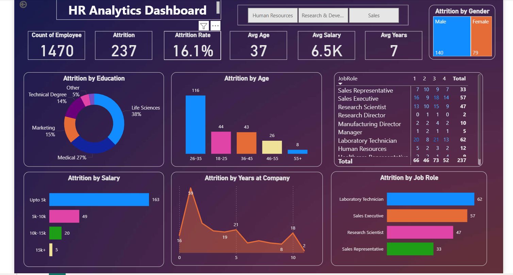

## HR Analytics Dashboard – End-to-End Data Analysis Project

## 📌 Project Overview

This project analyzes employee attrition trends and workforce insights using SQL and Power BI. The objective is to identify key factors contributing to employee turnover and provide data-driven business insights.

## 🛠 Tools Used

SQL (Database creation, normalization, analysis queries)

Power BI (Data modeling, DAX, dashboard design)

DAX (KPI calculations & metrics)

## 🗂 Project Workflow

Created HR database in SQL.

Normalized raw data into employees, job_details, and compensation tables.

Performed analytical SQL queries.

Connected SQL database to Power BI.

Built interactive dashboard with KPIs and insights.

Implemented DAX measures for attrition rate and workforce metrics.

## 📊 Key KPIs

Total Employees

Total Attrition

Attrition Rate

Average Salary

Average Age

Average Years at Company

## 🔎 Key Insights

16.1% attrition rate observed.

Majority attrition occurs in salary slab below 5K.

Employees within first 3 years are more likely to leave.

Laboratory Technicians and Sales Executives show highest turnover.

Age group 26–35 shows peak attrition.

## 📷 Dashboard Preview

